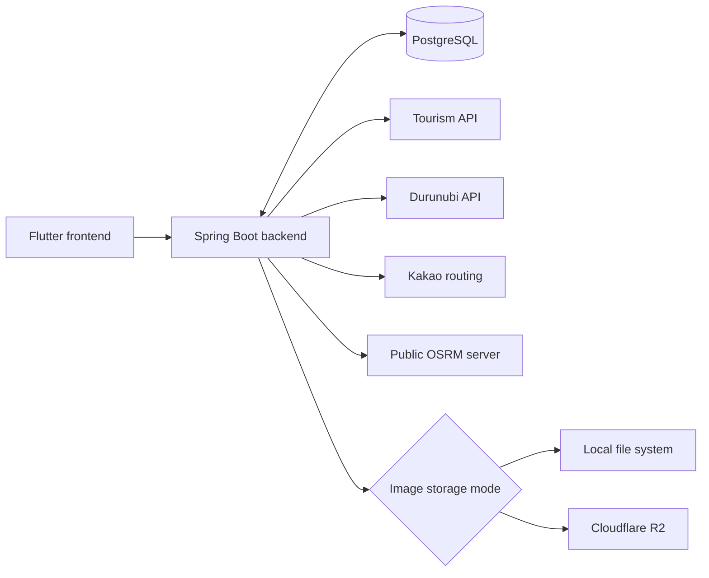

# Backend

> 공식 프로젝트명과 제품 설명은 아직 확인이 필요합니다.

관광지 정보와 도보 여행 기능을 제공하는 Spring Boot 백엔드입니다. 외부 관광·트레일·길찾기 API를 연결하고, 사용자 인증, 경로 및 여정 데이터, 이미지 저장을 처리합니다.

## 프로젝트 개요

이 서비스는 클라이언트가 관광지와 도보 경로를 탐색하고, 순례길·트레일·사용자 여정을 관리할 수 있도록 REST API를 제공합니다. 데이터는 PostgreSQL에 저장하며, 업로드 이미지는 로컬 파일 시스템 또는 Cloudflare R2를 선택해 저장하도록 구현되어 있습니다.

## 시스템 구성

아래 다이어그램은 전체 서비스 구성을 높은 수준에서 보여줍니다. Flutter frontend와의 관계는 이 backend repository 단독으로 검증된 연결이 아니라 전체 프로젝트 맥락이며, production deployment 구조를 의미하지 않습니다.



Cloudflare R2는 `STORAGE_TYPE=r2`를 선택한 경우에만 사용합니다.

## 주요 기능

- 관광지 조회와 이미지 프록시
- 관광지 기반 경로 조회·추천·최적 경로 계산
- 순례길 조회·생성·저장
- 두루누비 트레일 조회와 인근 트레일 조회
- 사용자 경로 게시, 경유지 이미지 업로드, 좋아요·스크랩·댓글
- 진행 중인 여정의 생성, 위치 기록, 완료/중단 및 이력 조회
- 사용자 프로필 조회·수정
- JWT 기반 로그인·회원가입 및 BCrypt 비밀번호 해싱

## 기술 스택

- Java 17, Spring Boot 3.2.4, Gradle Wrapper 8.14
- PostgreSQL, Spring Data JPA, Hibernate
- Spring Security, JWT (JJWT), BCrypt
- AWS SDK S3 client를 통한 Cloudflare R2 연동 구현
- Docker (Java 17 multi-stage build)

## 프로젝트 구조

```text
backend/
├── src/
│   ├── main/
│   │   ├── java/com/se_lab/project/
│   │   │   ├── config/        # Web, R2, HTTP client 설정
│   │   │   ├── controller/    # HTTP API controller
│   │   │   ├── dto/           # 요청·응답 DTO
│   │   │   ├── entity/        # JPA entity
│   │   │   ├── global/        # security, JWT, 예외 처리, seeding
│   │   │   ├── planner/       # 경로 계획과 이동 시간 계산
│   │   │   ├── repository/    # Spring Data JPA repository
│   │   │   └── service/       # 도메인 로직, 외부 API, 저장소 서비스
│   │   └── resources/
│   │       └── application.yml
│   └── test/
│       ├── java/com/se_lab/project/
│       └── resources/
├── docs/
│   ├── features/
│   ├── api-spec.md
│   └── deployment-plan.md
├── gradle/
├── Dockerfile
├── build.gradle
├── gradle.properties
├── gradlew
├── .env.example
├── api-test.http
├── http-client.env.json
└── http-client.private.env.example.json
```

## 시작하기

### 사전 요구사항

- Java 17
- JDBC URL을 통해 접근 가능한 PostgreSQL
- tourism, Durunubi, Kakao 연동에 필요한 외부 API credential
- Gradle은 repository의 Wrapper로 제공되므로 별도 Gradle 설치가 필요하지 않습니다.

### 환경 변수

애플리케이션은 시작 시 repository root의 `.env` 파일이 있으면 이를 system property로 선택적으로 불러옵니다. 프로세스 환경변수도 사용할 수 있습니다. 로컬 설정은 `.env.example`을 복사해 준비하고, 실제 값은 Git에 포함하지 않으며 secret을 문서나 로그에 기록하지 마세요.

#### 로컬 설정 파일 만들기

아직 로컬 설정 파일이 없을 때는 다음 명령으로 템플릿을 복사합니다. `-n` 옵션은 이미 존재하는 개인 설정 파일을 덮어쓰지 않습니다.

```bash
cp -n .env.example .env
cp -n http-client.private.env.example.json http-client.private.env.json
```

`.env`에는 애플리케이션 환경변수를, `http-client.private.env.json`에는 `api-test.http`의 local 테스트 계정 `email`과 `password`를 설정합니다. `http-client.env.json`은 local `baseUrl`을 제공합니다.

`.env`와 `http-client.private.env.json`은 `.gitignore`에 포함되어 있습니다.

다음 변수는 애플리케이션 수준의 기본값이 없으며, 기본 애플리케이션 설정에서 데이터베이스와 외부 서비스 client를 초기화하는 데 필요합니다.

| 필수 환경변수 | 용도 |
| --- | --- |
| `DB_URL`, `DB_USERNAME`, `DB_PASSWORD` | PostgreSQL JDBC 연결 |
| `JWT_SECRET` | JWT 서명 secret |
| `TOUR_API_BASE_URL`, `API_TOKEN` | Tourism API base URL 및 service key (`API_TOKEN`은 Durunubi key의 기본값이기도 합니다) |
| `ROUTE_API_BASE_URL` | Durunubi API base URL |
| `KAKAO_API_KEY` | Kakao directions API credential |

| 선택 환경변수 | 기본값 / 용도 |
| --- | --- |
| `PORT` | `8080`; HTTP 수신 포트 |
| `APP_LOG_LEVEL` | `INFO` |
| `JPA_DDL_AUTO` | `update` |
| `JPA_SHOW_SQL` | `false` |
| `JWT_EXPIRATION_TIME` | `86400000` milliseconds |
| `WALKING_COURSE_SERVICE_KEY` | 미설정 시 `API_TOKEN` 사용 |
| `STORAGE_TYPE` | `local`; `local` 또는 `r2` 선택 |
| `FILE_UPLOAD_DIR` | 로컬 저장소의 애플리케이션 기본값은 `./.local/uploads`; Docker runtime에서는 `/tmp/uploads`로 설정 |
| `FILE_LEGACY_UPLOAD_DIR` | `./.local/uploads/user-routes`; legacy 읽기 전용 업로드 위치 |
| `MAX_UPLOAD_FILE_SIZE`, `MAX_UPLOAD_REQUEST_SIZE` | `10MB`, `12MB`; `IMAGE_MAX_FILE_SIZE`, `IMAGE_MAX_REQUEST_SIZE`도 fallback 이름으로 지원 |
| `APP_SEED_ENABLED` | `false`; 명시적으로 `true`로 설정했을 때만 초기 trail/pilgrimage 데이터 적재 활성화 |
| `CORS_ALLOWED_ORIGIN_PATTERNS` | `http://localhost:*` |
| `IMAGE_PROXY_ALLOWED_HOSTS` | `tong.visitkorea.or.kr` |

R2를 설정할 때만 `STORAGE_TYPE=r2`를 지정합니다. R2 구현에는 `R2_ENDPOINT`, `R2_BUCKET`, `R2_ACCESS_KEY_ID`, `R2_SECRET_ACCESS_KEY`, `R2_PUBLIC_BASE_URL`이 필요합니다. `R2_OBJECT_PREFIX`는 선택값이며 기본값은 `dev`입니다.

### 로컬 실행

```bash
./gradlew bootRun
```

애플리케이션을 시작하기 전에 필수 환경변수를 설정하고 PostgreSQL에 연결할 수 있는지 확인하세요. `PORT`가 제공되지 않으면 기본 HTTP 포트는 `8080`입니다.

### 테스트 실행

```bash
./gradlew test
```

현재 테스트는 예외 응답, 이미지 검증, local/R2 저장소 동작, tourism-image URL 정규화에 집중되어 있습니다. 완전한 통합 또는 배포 테스트 모음은 아닙니다.

### 빌드

```bash
./gradlew clean bootJar
```

실행 가능한 JAR는 `build/libs/app.jar`에 생성됩니다.

## 이미지 저장소

두 가지 이미지 저장 모드가 구현되어 있습니다.

- **Local (`STORAGE_TYPE=local`, 기본값):** 파일은 `FILE_UPLOAD_DIR` 아래에 저장됩니다. 애플리케이션 기본값은 `./.local/uploads`이며, 포함된 Docker runtime은 `FILE_UPLOAD_DIR=/tmp/uploads`로 설정합니다. 저장된 이미지 URL은 `/uploads/<sub-directory>/<generated-file>` 형식을 사용합니다. 설정된 legacy 업로드 디렉터리는 기존 파일을 읽기 전용으로 제공할 수 있습니다.
- **Cloudflare R2 (`STORAGE_TYPE=r2`):** 애플리케이션은 S3-compatible API를 사용하며 `<R2_OBJECT_PREFIX>/<sub-directory>/<generated-file>` 구조로 객체를 저장합니다. 반환 URL은 `R2_PUBLIC_BASE_URL`을 기준으로 구성합니다.

R2 지원은 코드에 존재하고 집중된 저장소 테스트가 있으나, 실제 Cloudflare 계정과 bucket에서의 성공적인 동작은 이 repository에서 검증되지 않았습니다. Supabase Storage는 구현되지 않았습니다.

## 데이터베이스

PostgreSQL은 Spring Data JPA와 Hibernate를 통해 접근합니다. 기본 Hibernate 설정은 `ddl-auto=update`이며 `JPA_DDL_AUTO`로 재정의할 수 있습니다.

현재 Flyway 또는 Liquibase migration 설정은 없습니다. versioned migration 절차를 아직 사용할 수 없으므로 schema 변경과 기존 데이터베이스 데이터를 주의해서 다뤄야 합니다.

## 인증

인증은 stateless JWT 기반입니다. 비밀번호는 저장 전에 BCrypt로 해싱됩니다.

`POST /api/v1/auth/signup`과 `POST /api/v1/auth/login`은 공개되어 있습니다. 보안 설정은 place, home, route, trail, image, upload 리소스의 공개 접근도 허용하며, pilgrimage 조회와 공개 user-route 조회도 공개되어 있습니다. `SecurityConfig`에서는 명시적으로 공개된 경로 외의 요청에 인증이 필요하며, pilgrimage 생성은 그중 하나입니다. `/api/v1/admin/**`는 `denyAll()`로 명시적으로 차단됩니다. 이 README는 API 명세가 아니므로 정확한 요청과 응답 계약은 controller 코드를 확인하세요.

## 외부 서비스 / API

- 장소 검색 및 상세 정보를 위한 Tourism API
- walking-course/trail 데이터를 위한 Durunubi API
- routing 및 이동 시간 계산을 위한 Kakao directions API
- 도보 경로 계산을 위한 Public OSRM demo server
- 선택적인 S3-compatible 이미지 저장 모드를 위한 Cloudflare R2

외부 서비스의 availability, quota, credential, production 환경 적합성은 이 repository가 보장하지 않습니다.

## Docker

포함된 `Dockerfile`은 Java 17 JDK build stage와 Java 17 JRE runtime stage를 사용합니다. `app.jar`를 빌드하고 비루트 `spring` 사용자로 실행하며 포트 `8080`을 노출합니다. runtime에서 애플리케이션은 `PORT`를 읽고, 값이 없으면 기본값 `8080`을 사용합니다.

현재 repository에는 Docker Compose 또는 Docker `HEALTHCHECK`가 포함되어 있지 않습니다.

## 테스트

자동화된 테스트 범위는 저장소, 이미지 검증, URL 정규화, API 예외 처리에 대한 집중된 테스트로 제한됩니다. 이 문서는 포괄적인 coverage, end-to-end 검증, 배포 환경에서의 성공적인 실행을 주장하지 않습니다.

## 배포 상태

repository에는 Docker build 구성과 환경변수 기반 애플리케이션 설정이 포함되어 있습니다. 실제 Render 배포 상태는 repository 내부 근거가 아니라 외부 배포 서비스에서 관리·검증됩니다. 운영 환경 구성과 rollback 절차는 별도 배포 설정에서 관리합니다.

다음 운영 항목은 현재 구현되었거나 완료된 것으로 확인되지 않았습니다.

- GitHub Actions CI/CD workflow
- Database migrations (Flyway/Liquibase)
- 전용 애플리케이션 health endpoint
- Docker `HEALTHCHECK`
- `render.yaml` Blueprint
- Production deployment validation, 데이터베이스 연결, R2 bucket 접근, rollback 검증

`docs/deployment-plan.md`는 계획 문서이며, production 구성 또는 Supabase deployment 완료를 단독으로 검증하는 근거가 아닙니다.

## 관련 문서

- [`docs/deployment-plan.md`](docs/deployment-plan.md): deployment 준비 및 검증 계획입니다. 아직 구현되지 않았을 수 있는 계획 작업과 결정을 포함합니다.
- [`docs/features/LAB-12-route-planner.md`](docs/features/LAB-12-route-planner.md): route-planner 기능에 한정된 초기 메모입니다.
- [`docs/api-spec.md`](docs/api-spec.md): 현재 비어 있으며 완성된 API 명세가 아닙니다.
- [`.env.example`](.env.example): secret이 없는 로컬 환경변수 template입니다.

## 현재 제한사항 / 개발 상태

- database migration framework가 구성되어 있지 않습니다.
- CI/CD workflow가 없습니다.
- 전용 health endpoint가 없습니다.
- 자동화된 테스트는 제한된 범위의 unit-level 항목만 다룹니다.
- R2 코드는 존재하지만 실제 Cloudflare R2 환경에서의 검증 여부는 확인되지 않았습니다.

## 기여하기

`CONTRIBUTING.md`는 아직 추가되지 않았으므로, 공식 기여, branch, review, merge, release 규칙은 이 repository에 정의되어 있지 않습니다. 이 README는 추가 기여 규칙을 정의하지 않습니다.

---
