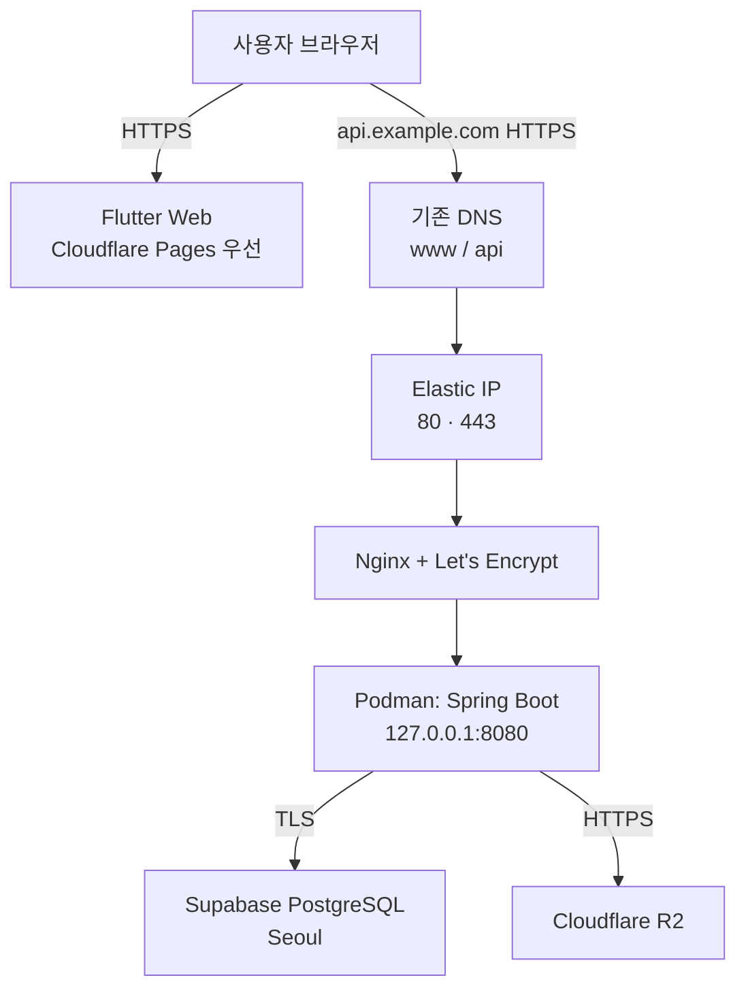
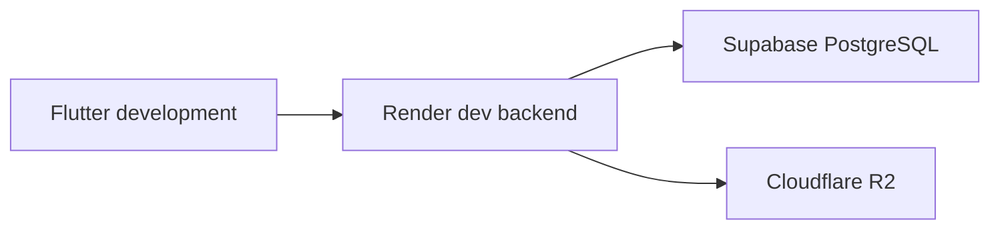
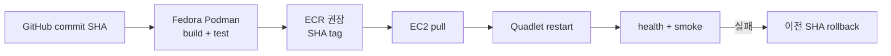

# 2026 관광데이터 활용 공모전 Backend Production AWS 이전 계획

> 조사 기준일: 2026-09-06
>
> 대상: `sae-lab/backend` (Spring Boot, Java 17, Gradle, PostgreSQL)
> 범위: 조사와 실행 계획만 포함. AWS 리소스·GitHub 파일·실제 인프라는 변경하지 않음.

## 구현 검증 기록 (2026-09-07)

- 작업 브랜치: `dev`에서 분기한 `chore/production-readiness`
- 운영 기준: `main`, `ap-northeast-2`, Supabase 유지, ECR repository `sightseeing-backend-prod`
- Java: 호스트 기본 Java 25 대신 설치된 Temurin 17을 사용하고 Gradle toolchain을 Java 17로 고정
- 검증: Java 17 `clean test bootJar` 성공(21 tests), Podman `linux/amd64` image build 성공
- image: `sightseeing-backend-prod:health-check`, 344,727,884 bytes, runtime user `spring`
- runtime: 1536 MiB memory limit, `JPA_DDL_AUTO=validate`, seeder disabled로 기동
- health: `/livez`, `/readyz`, `/healthz` 모두 HTTP 200/`UP`; simulated DB health DOWN 시 readiness/healthz 503, livez 200 검증. 실제 DB/network 장애 주입은 아직 수행하지 않음
- package pipeline: PR/`dev`는 Java 17 test와 container build, 수동 실행은 `dev` history의 지정 SHA를 immutable GHCR candidate로 발행, `main` push는 해당 SHA image와 mutable `:main` 발행. 이미 candidate로 발행된 SHA는 재빌드하지 않고 `main` 승격 시 그대로 재사용
- 아직 수행하지 않음: ECR/AWS 생성, GitHub Actions, EC2 배포, 실제 DB 장애 주입, 부하/RSS 측정

## 검증 기록 (2026-09-06)

이 표는 초안 자체를 재검증한 결과다. `NEEDS CORRECTION` 항목은 아래 본문에 이미 반영했고, `NEEDS MORE EVIDENCE`는 실제 repository/계정/트래픽 확인 전에는 확정하지 않는다.

| # | 검증 항목 | 결과 | 검증 결과와 반영 내용 |
|---:|---|---|---|
| 1 | 최초 요청의 12개 산출물 | **VERIFIED** | 요청한 1~12 절, 두 Mermaid diagram, checklist, issue, 내일 3개 작업이 모두 있음 |
| 2 | 서울 리전 비용 | **NEEDS CORRECTION** | 초안의 넓은 추정 범위를 공식 AWS Price List 단가로 교체. CloudWatch·CloudFront·전송량은 사용량 미확정이므로 산식/범위만 유지 |
| 3 | EC2 + Supabase network/egress | **VERIFIED** | AWS→Supabase 요청 방향은 AWS internet egress, Supabase→EC2 결과 방향은 AWS ingress이자 Supabase egress임을 더 명확히 기술 |
| 4 | 현재 RDS 불필요 판단 | **NEEDS CORRECTION** | RDS가 기술적으로 필수는 아니며 migration 보류 결론은 유지. 단, Supabase Free에는 automatic backup/SLA가 없고 inactivity pause가 있어 plan/backup 결정이 선행되어야 함 |
| 5 | EIP·ALB·NAT·Route 53·CloudFront·ACM | **NEEDS CORRECTION** | ALB의 2-AZ requirement와 NAT 서울 단가 추가. ACM exportable public certificate를 EC2에서도 쓸 수 있도록 바뀐 현재 기능을 반영 |
| 6 | HTTPS 추천 | **VERIFIED** | 단일 EC2 + Nginx + Let's Encrypt는 규모에 적절함. 인증서 자동 갱신 검증은 필수 |
| 7 | Security Group ports | **VERIFIED** | 80/443 public, 8080 closed/localhost, 22 `/32`는 타당. SSH key-only/password disabled 또는 SSM을 추가 명시 |
| 8 | Actuator health | **NEEDS CORRECTION** | liveness/readiness 분리는 타당. Podman health 실패 자동 복구에는 `HealthOnFailure=kill`이 필요하며 readiness 실패로 restart하면 안 됨 |
| 9 | Java 17 multi-stage/Podman 흐름 | **PARTIALLY VERIFIED** | Dockerfile 원문, amd64 build, 비루트 runtime, 1536 MiB 제한 기동, health를 검증했다. arm64와 실제 peak RSS는 추가 확인 필요 |
| 10 | 혼합 운영 구조의 누락 위험 | **NEEDS CORRECTION** | Free plan, schema compatibility, pool size, 중복 scheduler/seeder, API quota, R2 namespace, DNS rollback 위험을 추가 |
| 11 | 공식 문서가 없는 주장/추정 | **NEEDS CORRECTION** | 비용의 공식 단가·추정·설계 판단을 분리하고 unsupported 판단 목록을 추가 |
| 12 | AWS 작업 전 결정사항 | **NEEDS CORRECTION** | 별도 pre-flight decision gate를 추가 |

## 1. Executive Summary

- 첫 production은 **서울 리전의 단일 EC2 `t3.small` + 30 GiB gp3 + Elastic IP + Nginx/Let's Encrypt + Podman Quadlet**으로 시작하는 것이 가장 현실적이다.
- `t3.small`을 먼저 고르는 이유는 Fedora/Podman 및 현재 컨테이너 검증 경로와 같은 x86_64라서 일정 위험이 가장 낮기 때문이다. ARM64 이미지 검증이 끝나면 더 저렴한 `t4g.small`로 바꿀 수 있다.
- EC2는 public subnet 한 곳에 두고 80/443만 공개한다. 8080은 `127.0.0.1`에만 바인딩하고, 22는 현재 관리자 IP `/32`에만 임시 허용한다.
- HTTPS는 **Nginx + Let's Encrypt**를 권장한다. 지금 ALB는 단일 인스턴스의 가용성을 높이지 못하면서 월 고정비만 추가한다.
- PostgreSQL provider는 **A. 지금 Supabase 유지**가 결론이다. 다만 현재 Free plan을 production에도 그대로 쓸지, Pro로 올릴지, 별도 logical backup으로 위험을 수용할지는 AWS 생성 전에 결정해야 한다.
- Render dev, Supabase, Cloudflare R2는 유지하고 AWS production backend만 분리한다. frontend는 당장은 Cloudflare Pages가 최소 변경안이다.
- 배포는 EC2에서 소스를 빌드하지 않는다. Phase 1은 Fedora에서 검증한 immutable image를 registry에 올리고 EC2가 pull하는 수동 절차, Phase 2부터 GitHub Actions가 test/build/push한다.
- 최소 월 AWS 비용은 공식 단가 기준 고정분이 **약 USD 25.47**이고, 소량 ECR/CloudWatch를 포함한 실무 예산은 **약 USD 26~35**다. 실제 2-AZ application HA 구성은 **약 USD 78~105**로 추정한다(세금·도메인·초과 트래픽 제외).

## 2. Recommended Architecture

개발 환경은 production과 분리해 그대로 유지한다.

AWS에서 public subnet의 인스턴스가 인터넷과 통신하려면 route table의 Internet Gateway 경로와 public IPv4/EIP가 필요하다. 이 구조는 단일 서버가 Supabase, Tour API, R2로 직접 outbound 통신하므로 private subnet과 NAT Gateway가 필요 없다. [AWS: Internet Gateway](https://docs.aws.amazon.com/vpc/latest/userguide/VPC_Internet_Gateway.html)

## 3. Architecture Decision Table

| 서비스/구성 | 사용 여부 | 이유 | 대안 | 도입 시점 |
|---|---|---|---|---|
| VPC | **지금 반드시 필요** | EC2와 Security Group의 네트워크 경계. 별도 custom VPC 또는 단순한 전용 VPC 사용 | default VPC | production 최초 구성 |
| Public subnet | **지금 반드시 필요** | 단일 EC2가 직접 HTTPS를 받고 외부 DB/API/R2에 접속 | private subnet + ALB/NAT | production 최초 구성 |
| Private subnet | 지금 불필요 | 단일 EC2 구조에서는 NAT/ALB 비용과 운영 복잡도만 증가 | 2-AZ private subnet | 인스턴스 2대/ALB 도입 시 |
| Internet Gateway | **지금 반드시 필요** | public subnet의 inbound/outbound 인터넷 경로 | 없음 | production 최초 구성 |
| NAT Gateway | **지금 불필요** | private subnet이 없고, 시간당·GB당 요금이 별도로 발생 | NAT instance, VPC endpoint | private subnet 도입 시 재검토 |
| Elastic IP | **지금 반드시 필요** | 단일 EC2 교체·재부팅 후에도 API DNS 대상 고정 | ALB DNS, CloudFront | production 최초 구성 |
| Security Group | **지금 반드시 필요** | stateful virtual firewall이며 별도 사용료가 없다. [AWS](https://docs.aws.amazon.com/vpc/latest/userguide/vpc-security-groups.html) | host firewall만 사용 | production 최초 구성 |
| ALB | 지금 불필요 | 인스턴스 1대에서는 backend 장애를 대체할 target이 없고 고정비가 큼. ALB 자체도 서로 다른 AZ의 subnet을 최소 2개 요구한다. [AWS](https://docs.aws.amazon.com/elasticloadbalancing/latest/application/application-load-balancers.html) | Nginx on EC2 | 2대 이상/무중단 요구 시 |
| Route 53 DNS | 지금 불필요 | 기존 DNS 사업자에서 A/CNAME을 설정할 수 있음 | Route 53 hosted zone | DNS를 AWS로 통합하고 싶을 때 |
| Route 53 Health Check | 나중에 고려 | AWS endpoint에 대한 basic health check는 최대 50개까지 무료 대상이나, HTTPS 등 optional feature는 별도 과금될 수 있다. [AWS pricing](https://aws.amazon.com/route53/pricing/) | 외부 uptime monitor | `/healthz` 완성 후 |
| CloudFront (API 앞단) | 지금 불필요 | 동적 API 캐시 이득이 작고 origin TLS/제한 설정이 추가됨. 나중에 custom domain을 쓰면 CloudFront viewer certificate는 `us-east-1`의 ACM 인증서여야 한다. [AWS](https://docs.aws.amazon.com/AmazonCloudFront/latest/DeveloperGuide/cnames-and-https-requirements.html) | 직접 Nginx HTTPS, ALB | WAF·글로벌 트래픽 필요 시 |
| ACM | 지금 불필요 | 통합 서비스용 비수출 인증서는 무료다. 현재는 exportable public certificate를 EC2에도 설치할 수 있지만 발급/갱신 비용과 배포 자동화가 필요해 Let's Encrypt보다 이점이 작다. [AWS feature](https://docs.aws.amazon.com/acm/latest/userguide/acm-exportable-certificates.html), [AWS pricing](https://aws.amazon.com/certificate-manager/pricing/) | Let's Encrypt | ALB/CloudFront 또는 ACM 인증서 중앙화가 필요할 때 |
| ECR | 선택이지만 **권장** | immutable image 배포, EC2와 같은 리전 pull 전송료 없음, 저장료가 작음. [AWS](https://aws.amazon.com/ecr/pricing/) | GHCR | Phase 1 수동 image 배포부터 |
| CloudWatch 기본 지표 | **지금 반드시 필요** | CPU와 EC2 status check를 별도 설치 없이 확인 | 수동 점검 | production 최초 구성 |
| CloudWatch Agent | 권장 | 기본 EC2 지표에 없는 memory/disk와 application log 수집 | `journalctl`, `df`, `free` 수동 점검 | 첫 배포 직후 |
| RDS | 지금 불필요 | 정상인 Supabase를 옮길 즉시 이익이 작음 | Supabase 유지 | 공모전 종료 후 측정 기반 재검토 |
| Cloudflare R2 | 유지 | 이미 사용하는 이미지 저장소를 옮길 이유 없음 | S3 | 장애·비용·기능 요구가 생길 때 |
| Render dev | 유지 | production과 분리된 개발 검증 경로 | 별도 AWS dev EC2 | Render 제약이 실제 문제가 될 때 |
| Frontend Cloudflare Pages | 우선 유지 | frontend까지 동시에 이전하는 변경 범위를 피함 | S3 + CloudFront | 별도 비교 후 결정 |

AWS는 public IPv4와 사용 중인 EIP 모두 시간당 USD 0.005를 부과하므로, EIP는 할당만 해두지 말고 반드시 EC2에 연결하고 불필요해지면 해제해야 한다. [AWS VPC pricing](https://aws.amazon.com/vpc/pricing/)

### EC2 최소 사양 결정

| 항목 | 권장값 | 판단 |
|---|---|---|
| Region | `ap-northeast-2` (Seoul) | 사용자·Supabase와 가까운 경로 유지 |
| 초기 instance | **`t3.small` (x86_64, 2 vCPU, 2 GiB)** | 현재 x86 Fedora/Podman 검증과 동일 아키텍처라 일정 위험이 낮음 |
| 비용 최적화 후보 | `t4g.small` (ARM64, 2 vCPU, 2 GiB) | ARM64 image build/run smoke test 통과 후 전환. AWS는 T4g가 T3보다 최대 40% price-performance 향상이라고 설명한다. [AWS](https://aws.amazon.com/ec2/instance-types/t4/) |
| 제외 | `*.micro` 1 GiB | JVM + OS + Nginx + monitoring에 여유가 너무 적음 |
| 상향 조건 | `t3.medium` 또는 `t4g.medium` 4 GiB | 정상 부하에서 memory > 80%, OOM/restart, GC 지연 반복 시 |
| Root disk | **30 GiB gp3** | OS, image 2세대, journal/log 여유. gp3는 추후 온라인 확장이 가능하다. [AWS](https://docs.aws.amazon.com/ebs/latest/userguide/requesting-ebs-volume-modifications.html) |
| Container limit | 약 `1536m` | host/Nginx/agent에 약 0.5 GiB 남김 |
| JVM 시작값 | `-Xms256m -Xmx768m` | Spring Boot 기능/트래픽 측정 전의 보수적 시작점. metaspace/native memory 포함 여유 확보 |

`t3.small` 확정 전 **추가 확인 필요**: 현재 Docker base image가 `linux/amd64`에서 정상 빌드되는지, 실제 idle/peak RSS, Spring Boot startup memory, container image 크기. `t4g.small` 전환 전에는 모든 base image와 native dependency의 `linux/arm64` 지원 및 arm64 smoke test가 필수다.

### Container 실행 방식

- EC2 OS가 Amazon Linux라면 Docker가 문서·운영 예시 면에서 무난하고, Fedora 계열이면 익숙한 Podman을 써도 된다. 서비스 규모상 ECS/EKS는 필요 없다.
- Podman을 택하면 **systemd Quadlet** 한 개로 관리한다. rootful과 전용 non-root user 중 하나를 AMI/운영 방식과 함께 확정한다. `[Service] Restart=on-failure`와 `[Install] WantedBy=multi-user.target`는 process/container 종료 및 서버 재부팅 뒤 자동 시작을 처리한다. health failure까지 restart로 연결하려면 `[Container] HealthOnFailure=kill`이 추가로 필요하다. [Podman Quadlet](https://docs.podman.io/en/latest/markdown/podman-systemd.unit.5.html)
- image tag는 `latest` 단독이 아니라 Git commit SHA를 사용한다. 이전 SHA image를 1개 보존해 rollback한다.

## 4. Supabase vs RDS Decision

**결론: A. 지금 Supabase 유지.** 공모전 종료 후 지표가 근거를 만들면 C의 시점에 RDS를 다시 검토한다. B(공모전 전 RDS 이전)는 권장하지 않는다.

| 기준 | EC2 + Supabase | EC2 + RDS Single-AZ | 판단 |
|---|---|---|---|
| 비용 | Free면 $0이지만 5 GB egress, 500 MB DB, inactivity pause 및 기능 제한이 있음. Pro는 $25/month부터 | instance + storage 고정비 발생 | Free는 저렴, production 기능은 별도 비교 필요 |
| latency | 둘 다 서울 리전이어도 public network/TLS 경로이며 변동 가능 | 같은 AZ/private address면 더 낮고 예측 가능 | RDS 우세, 단 실제 측정 필요 |
| egress | EC2→Supabase의 SQL 요청/TCP payload는 AWS internet outbound, Supabase→EC2의 query result는 AWS ingress이자 Supabase egress. Free는 5 GB egress 포함 | 같은 AZ EC2↔RDS private 통신은 data transfer charge 없음. 다른 AZ면 EC2 regional transfer charge가 생길 수 있음. [AWS](https://aws.amazon.com/rds/pricing/) | RDS private path 우세, 실제 byte/latency 측정 필요 |
| 운영 복잡도 | 기존 연결·대시보드·백업 유지 | 생성, SG, parameter, patch/backup, migration/cutover 필요 | Supabase 우세 |
| 보안 | TLS, credentials, Supabase network restriction 사용 가능. EC2 EIP allowlist 검토 | private subnet/SG로 DB 비공개 가능, KMS encryption 가능 | RDS 우세 |
| 백업 | **Free에는 automatic backup이 포함되지 않는다.** Pro는 daily backup 7일 보관. PITR는 별도 유료 add-on. [Supabase pricing](https://supabase.com/pricing) | automated backup 0~35일, console 기본 7일; encryption 시 logs/backups/snapshots도 암호화. [AWS backup](https://docs.aws.amazon.com/AmazonRDS/latest/UserGuide/USER_WorkingWithAutomatedBackups.BackupRetention.html), [AWS encryption](https://docs.aws.amazon.com/AmazonRDS/latest/UserGuide/Overview.Encryption.html) | Free 유지 시 external logical backup 필수 검토 |
| 공모전 안정성 | 현재 검증된 경로를 유지 | 새 migration 자체가 일정 위험 | Supabase 우세 |
| 향후 migration | 표준 PostgreSQL이므로 `pg_dump`/restore 경로를 준비 가능 | 도착 후 AWS 내부 통합이 쉬움 | 지금은 중립 |

### 유지 조건과 재검토 조건

Supabase를 유지하되 production 시작 전에 다음을 확인한다.

1. EC2에서 사용할 DB connection 방식이 direct IPv6인지 Supavisor pooler IPv4인지 확인한다. Supabase direct connection은 IPv6로 해석될 수 있고, IPv6가 없는 host는 pooler 또는 유료 IPv4 add-on이 필요할 수 있다. [Supabase](https://supabase.com/docs/guides/troubleshooting/supabase--your-network-ipv4-and-ipv6-compatibility-cHe3BP)
2. EC2→Supabase 왕복 지연의 p50/p95와 주요 endpoint 응답 시간을 시연 시나리오로 측정한다.
3. production EIP를 Supabase network restriction allowlist에 넣을지 결정한다. network restriction은 pooled/direct 경로 모두에 적용된다. [Supabase](https://supabase.com/docs/guides/platform/network-restrictions)
4. 선택한 plan에서 제공되는 backup의 보존·복원 절차를 확인하고, Free라면 외부 `pg_dump` 주기·암호화·복원 시험을 별도로 정한다. 공모전 직전에는 별도 logical backup을 남긴다.

현재 확인된 Supabase Free 정책은 500 MB DB, 5 GB egress, 1주 inactivity 후 pause, automatic backup 미포함, uptime SLA 미포함이다. 따라서 **“Supabase 유지”는 “Free plan을 아무 보완 없이 production에 사용”한다는 뜻이 아니다.** production go-live 전 `Pro $25/month`와 `Free + 정기 external pg_dump + pause/SLA 위험 수용` 중 하나를 결정해야 한다. [Supabase pricing](https://supabase.com/pricing)

### EC2 + Supabase network billing의 정확한 해석

- Supabase가 Seoul region에 있어도 VPC peering/PrivateLink를 별도로 사용하지 않는 현재 구성은 **AWS private same-AZ 통신이 아니다**. 따라서 “같은 서울 리전이므로 EC2↔DB transfer가 무료”라고 단정하면 안 된다.
- AWS 관점에서 EC2가 보내는 SQL request와 protocol overhead는 internet data transfer out에 잡힐 수 있다. 반대로 큰 query result가 EC2로 들어오는 방향은 AWS data transfer in이므로 AWS egress가 아니다.
- Supabase 관점에서는 database가 EC2로 내보내는 query result가 Supabase egress quota에 포함된다. [Supabase billing FAQ](https://supabase.com/docs/guides/platform/billing-faq)
- AWS internet outbound는 계정 전체 첫 100 GB/month 무료 정책이 있어 이 규모에서는 보통 $0일 가능성이 높지만, **실제 AWS Cost Explorer와 Supabase Usage 값 없이는 확정할 수 없다.** [AWS](https://aws.amazon.com/ec2/pricing/on-demand/)
- 비용보다 먼저 확인할 위험은 latency, connection limit, timeout이다. Hikari maximum pool size와 Render dev + EC2 production의 합산 connection 수를 Supabase plan 한도 안으로 제한한다.

다음 중 하나가 발생하면 공모전 종료 후 RDS migration issue를 연다: DB p95 지연이 사용자 경험을 지속적으로 해침, Supabase egress/plan 비용이 RDS 예상비용을 넘음, private-only DB가 요구됨, 요구 RPO가 선택한 backup 주기보다 짧아짐, AWS 내 2대 이상 backend로 확대됨.

RDS를 선택하더라도 Single-AZ DB instance를 위한 DB subnet group은 일반적으로 서로 다른 AZ의 subnet을 최소 2개 포함해야 한다. 따라서 현재 최소 VPC에 RDS를 뒤늦게 추가하려면 두 번째 AZ subnet 설계가 필요하다. 이는 “RDS instance가 반드시 Multi-AZ”라는 뜻은 아니다. [AWS RDS VPC](https://docs.aws.amazon.com/AmazonRDS/latest/UserGuide/USER_VPC.WorkingWithRDSInstanceinaVPC.html)

## 5. AWS Cost Estimate

> 단위: USD/month, 730시간 상시 실행, `ap-northeast-2`, 세금·환율·도메인 등록비 제외. EC2/EBS/ALB/NAT/RDS 단가는 AWS Price List의 서울 리전 2026-09-04 전후 publication을 직접 대조했다. CloudWatch·CloudFront·data transfer는 실제 사용량이 없으므로 확정할 수 없다. 실제 생성 직전 AWS Pricing Calculator로 한 번 더 확인한다.

### 항목별 예상

| 항목 | 최소 구성 | 2-AZ HA 비교 구성 | 검증된 단가/주의 |
|---|---:|---:|---|
| EC2 | 1×`t3.small` **$18.98** | 2×`t3.small` **$37.96** | Linux On-Demand $0.026/hour. `t4g.small`은 $0.0208/hour = **$15.18/month**. [AWS Price List](https://pricing.us-east-1.amazonaws.com/offers/v1.0/aws/AmazonEC2/current/ap-northeast-2/index.json) |
| EBS gp3 | 30 GiB **$2.74** | 2×30 GiB **$5.47** | Seoul $0.0912/GB-month. snapshot 별도. [AWS Price List](https://pricing.us-east-1.amazonaws.com/offers/v1.0/aws/AmazonEC2/current/ap-northeast-2/index.json) |
| Elastic/public IPv4 | 1× **$3.65** | **약 $14.60** 가정 | $0.005/IP-hour. HA 예시는 ALB 2개 이상의 public IP + public-subnet EC2 2개 public IP를 가정하되 실제 할당 수는 billing에서 확인. [AWS](https://aws.amazon.com/vpc/pricing/) |
| ALB | $0 | base **$16.43** + LCU | Seoul $0.0225/hour + $0.008/LCU-hour. 최소 2-AZ subnet 필요. [AWS Price List](https://pricing.us-east-1.amazonaws.com/offers/v1.0/aws/AWSELB/current/ap-northeast-2/index.json) |
| CloudFront | 사용 안 함: **$0** | 별도 frontend 결정 | traffic/request/선택 plan이 없어 금액 확정 불가. 임의의 `$0~5` 범위는 삭제. [AWS](https://aws.amazon.com/cloudfront/pricing/) |
| Route 53 hosted zone | 기존 DNS: **$0** | 사용 시 $0.50 + query | 첫 25개 zone은 $0.50/zone-month. [AWS](https://aws.amazon.com/route53/pricing/) |
| RDS PostgreSQL | 사용 안 함: **$0** | 별도 비교 | `db.t4g.micro` + 20 GiB gp3 약 **$20.87**, `db.t4g.small` + 20 GiB 약 **$39.85**. backup/storage/traffic 조건 별도. [AWS Price List](https://pricing.us-east-1.amazonaws.com/offers/v1.0/aws/AmazonRDS/current/ap-northeast-2/index.json) |
| CloudWatch | **$0~5 추정** | **$2~10 추정** | log GB, retention, custom metric/alarm 수가 없으므로 exact 불가. 기본 지표와 작은 log volume 가정. [AWS](https://aws.amazon.com/cloudwatch/pricing/) |
| ECR | **$0.10~0.50** | **$0.10~0.50** | 1~5 GB 보관 가정. $0.10/GB-month, 같은 리전 EC2 pull transfer는 무료. [AWS](https://aws.amazon.com/ecr/pricing/) |
| Data transfer | 100 GB 이하 가정: **$0** | 사용량 의존 | AWS 전체 internet outbound 첫 100 GB/month 무료. EC2→Supabase SQL 요청도 이 합계에 포함. [AWS](https://aws.amazon.com/ec2/pricing/on-demand/) |
| NAT Gateway | 사용 안 함: **$0** | 사용 안 함: **$0** | 서울 **$0.059/hour = $43.07/month + $0.059/GB**, public IPv4/일반 transfer 별도. 이 고정비 때문에 제외. [AWS Price List](https://pricing.us-east-1.amazonaws.com/offers/v1.0/aws/AmazonEC2/current/ap-northeast-2/index.json) |
| ACM | 사용 안 함: **$0** | ALB 통합 비수출 cert: **$0** | EC2용 exportable public cert는 무료가 아니므로 별도 계산. [AWS](https://aws.amazon.com/certificate-manager/pricing/) |

### 두 구성의 합계

| 구성 | 월 합계 | 포함 | 해석 |
|---|---:|---|---|
| **최소 비용 구조 (권장)** | 고정분 **$25.47**, 실무 예산 **약 $26~35** | 1×t3.small, 30 GiB gp3, 1×EIP, ECR 1~5 GB, 최소 CloudWatch | Nginx/Let's Encrypt, Supabase/R2/Pages 유지. Supabase plan 비용은 별도 |
| **실제 2-AZ HA 비교 구조** | **약 $78~105 추정** | 2×t3.small/EBS, ALB, public IPv4 가정, monitoring | 서로 다른 AZ에 healthy target 2개가 있어야 ALB가 application HA를 제공. NAT와 RDS는 제외 |

RDS PostgreSQL Single-AZ의 순수 instance+최소 gp3는 `db.t4g.micro` 약 **$20.87/month**, `db.t4g.small` 약 **$39.85/month**다. 초안의 `$30~55`는 정확하지 않아 수정했다. 이 가격은 RDS가 터무니없이 비싸다는 근거가 아니며, **현재 RDS를 보류하는 핵심 이유는 기존 Supabase migration/cutover 위험과 운영 범위 증가**다. 반대로 Supabase Pro($25/month)와 비교하면 RDS micro의 인프라 비용은 경쟁력이 있으므로 공모전 후 다시 측정·비교할 가치가 있다.

## 6. Security Design

### Network와 port

| Port | 제안 | Security Group / host 설정 |
|---:|---|---|
| 22/TCP | **특정 IP만 허용** | 관리자 현재 public IP `/32`만 임시 허용, public-key only, password/root login disabled. SSM Session Manager가 준비되면 inbound rule 자체 제거 |
| 80/TCP | **public 허용** | Let's Encrypt HTTP-01 및 HTTPS redirect만. application 응답 제공 금지 |
| 443/TCP | **public 허용** | Nginx가 TLS 종료 후 localhost:8080으로 proxy |
| 8080/TCP | **외부 차단** | SG inbound 없음 + container publish를 `127.0.0.1:8080:8080`으로 제한 |

- Security Group outbound는 초기에는 HTTPS/DB 연결이 정상화되도록 허용하되, Supabase DB port·DNS·HTTPS 요구사항을 확인한 뒤 최소화한다.
- host firewall에서도 8080을 차단해 SG 오설정에 대한 방어층을 둔다.
- `X-Forwarded-Proto`, client IP header는 Nginx에서 명시하고 Spring의 forwarded-header 처리 여부를 확인한다.
- CORS production allowlist에는 production frontend origin만 추가하고 Render dev origin과 섞지 않는다.

### HTTPS 선택

| 방식 | 비용 | 복잡도 | 안정성 | 결론 |
|---|---|---|---|---|
| **EC2 + Nginx + Let's Encrypt** | 인증서 무료, EC2 비용만 | 중간: 자동 갱신/방화벽 관리 | 단일 서버 수준 | **지금 추천** |
| EC2 + ALB + ACM | ALB 월 고정비 + LCU, 인증서 무료 | 중간 | TLS 관리 우수. target 1대면 app HA는 없음 | 2대 전환 시 |
| CloudFront → EC2 | 사용량 과금/plan, origin 설정 추가 | 높음 | edge TLS/WAF 가능 | API 캐시/WAF 요구 시 |

ACM exportable public certificate는 현재 EC2에도 설치할 수 있으므로 기술적으로 가능한 네 번째 선택지다. 다만 standard FQDN은 발급 및 갱신 때마다 비용이 있고 EC2 배포/갱신 자동화도 직접 구성해야 하므로, 이 프로젝트에서는 무료·자동화가 단순한 Let's Encrypt보다 낫지 않다. [AWS ACM exportable certificates](https://docs.aws.amazon.com/acm/latest/userguide/acm-exportable-certificates.html)

### Domain

- 기술적으로 CloudFront/ALB가 주는 hostname으로 시험할 수는 있지만, **Nginx + 공개 신뢰 TLS 및 안정적인 API URL에는 소유 도메인이 사실상 필요**하다.
- 도메인 하나를 사면 `www.example.com`은 Cloudflare Pages 또는 CloudFront/S3로, `api.example.com`은 EIP의 A record로 분리한다.
- Route 53으로 registrar나 DNS를 이전할 필요는 없다. ACM DNS validation도 기존 DNS 사업자에 ACM이 제공한 CNAME을 추가할 수 있다. [AWS ACM DNS validation](https://docs.aws.amazon.com/acm/latest/userguide/dns-validation.html)
- frontend와 API가 다른 origin이므로 CORS, cookie domain/SameSite/Secure 정책을 production 값으로 검증한다.

### Secrets

- DB password, JWT secret, Tour API key, R2 key를 image, repository, Quadlet unit 본문, shell history에 넣지 않는다.
- Phase 1은 root-only 환경 파일(`0600`)을 container에 주입하고 backup/출력에서 제외한다.
- Phase 2는 EC2 instance role + SSM Parameter Store `SecureString` 또는 Secrets Manager로 전환한다. Parameter Store `SecureString`은 KMS로 암호화된다. [AWS](https://docs.aws.amazon.com/systems-manager/latest/userguide/secure-string-parameter-kms-encryption.html)
- GitHub Actions가 AWS에 접근할 때는 장기 access key 대신 OIDC의 단기 credential을 사용한다. [GitHub](https://docs.github.com/actions/deployment/security-hardening-your-deployments/configuring-openid-connect-in-amazon-web-services)

## 7. Health Check Design

### Endpoint 설계

Spring Boot Actuator를 사용하되 HTTP로는 health만 노출한다. Actuator는 기본적으로 `/actuator/health`를 제공하며 `DataSourceHealthIndicator`는 DB connection 획득 가능 여부를 확인한다. [Spring Boot](https://docs.spring.io/spring-boot/reference/actuator/endpoints.html)

| Endpoint | 포함 | 사용처 | 실패 시 행동 |
|---|---|---|---|
| `/livez` | `livenessState`만 | container health check | `HealthOnFailure=kill` 설정 시 연속 실패 후 systemd restart |
| `/readyz` | `readinessState`, `db`, 필요 시 `diskSpace` | local deploy verification | traffic 전환 중지, 운영자 확인 |
| `/healthz` | readiness와 같은 판정, 응답은 status만 | Nginx 외부 HTTP/HTTPS check | alert; 자동 무한 재시작 금지 |
| `/actuator/health/**` | 외부 비공개 또는 health-only 제한 | localhost/admin 진단 | 상세는 인증된 관리자만 |

- `management.endpoint.health.show-details=never`와 `show-components=never`를 public endpoint에 적용한다. Spring Boot의 기본 detail 정책도 `never`이며, health group별로 제어할 수 있다. [Spring Boot](https://docs.spring.io/spring-boot/reference/actuator/endpoints.html)
- **Tour API와 Cloudflare R2는 liveness에 절대 포함하지 않는다.** 외부 장애 때문에 정상 JVM을 반복 재시작하면 cascading failure가 된다. Spring Boot도 liveness를 외부 시스템에 의존시키지 말라고 설명한다. [Spring Boot](https://docs.spring.io/spring-boot/reference/actuator/endpoints.html)
- DB는 핵심 기능 의존성이므로 `/readyz`에는 포함한다. 다만 DB 장애 때도 정적/제한적 응답을 제공하고 싶다면 readiness에서 빼고 별도 dependency status로 alert하는 선택지가 있다. 이 정책은 endpoint별 DB 의존도를 보고 **추가 확인 필요**다.
- Tour API/R2는 별도 custom dependency metric 또는 structured log로 `UP/DEGRADED`를 기록하고, timeout/circuit breaker/fallback을 사용한다. 일반 health를 `DOWN`으로 만들지는 않는다.

### 계층별 check

1. **Container**: 30초 간격으로 localhost `/livez`, 짧은 timeout, start period 60~120초, 3회 연속 실패 시 unhealthy. **Podman은 unhealthy 표시만으로 systemd restart가 보장되지 않으므로** Quadlet `HealthOnFailure=kill` + systemd `Restart=on-failure`를 함께 사용한다. [Podman](https://docs.podman.io/en/latest/markdown/podman-systemd.unit.5.html)
2. **EC2/systemd**: Quadlet `Restart=on-failure`, boot enable. restart count와 service status 확인.
3. **EC2 infrastructure**: AWS system/instance/EBS status check와 CloudWatch alarm. AWS status check는 매분 수행되고 system/instance/EBS 문제를 구분한다. [AWS](https://docs.aws.amazon.com/AWSEC2/latest/UserGuide/monitoring-system-instance-status-check.html)
4. **HTTP end-to-end**: 외부에서 `https://api.example.com/healthz`를 확인해 DNS, TLS, Nginx, app, DB 경로를 검증. Route 53 basic health check 또는 작은 외부 uptime monitor 사용.
5. **배포 직후 smoke**: `/livez`, `/readyz`, `/api/v1/home`(또는 대표 read endpoint), R2 image URL 순서로 확인.

검증 결과: Spring Boot 3.2.4에서 probes와 additional paths를 활성화해 `/livez`·`/readyz`를 main port에 노출했고, 별도 health group으로 `/healthz`를 추가했다. 현재 JRE image에는 별도 probe client를 추가하지 않았으므로 container 자체 `HEALTHCHECK`는 runtime/Quadlet 단계에서 host-side probe 또는 probe client 추가 중 결정한다.

### Render dev와 AWS production 차이

- Render는 platform health check 실패 시 배포/instance lifecycle을 플랫폼이 관리한다.
- 단일 EC2는 OS가 살아 있어도 application HTTP가 죽을 수 있으므로 **container restart + EC2 status check + 외부 HTTP check** 세 층을 직접 구성해야 한다.
- production health가 Render dev와 같은 Supabase를 보더라도, dev 장애나 test data가 production 판정에 영향을 주지 않도록 DB/schema 또는 최소한 credentials와 environment를 분리해야 한다. 현재 DB 분리 수준은 **추가 확인 필요**다.

## 8. Deployment Strategy

### 환경 분리

| 환경 | Frontend | Backend | DB | Image/secret |
|---|---|---|---|---|
| development | local/preview | Render dev | Supabase dev 또는 현행 DB | dev env |
| production | Cloudflare Pages 우선 | AWS EC2 | Supabase production connection | commit-SHA image, prod-only secret |

### 두 배포 방식 비교

| 기준 | A. EC2 `git pull` + build | B. CI build → registry → EC2 pull |
|---|---|---|
| 단순 시작 | 명령 수는 적음 | registry/IAM 초기 설정 필요 |
| 재현성 | EC2 상태·branch·cache에 의존 | commit SHA image로 고정 |
| production 부담 | Gradle/JDK/source 필요, 2 GiB에서 build OOM 위험 | runtime과 pull만 필요 |
| 보안 | source와 build credential이 서버에 남음 | 최소 pull 권한만 서버에 부여 가능 |
| rollback | 다시 checkout/build | 이전 SHA image로 즉시 복귀 |
| 자동화 | 취약 | Phase 2/3로 자연스럽게 확장 |
| 결론 | 임시 실험 외 비추천 | **production 표준으로 선택** |

정확히는 Phase 1에서 CI 자동화를 먼저 만들지 않고 **B의 수동 bridge**를 쓴다.

ECR은 기술적으로 필수는 아니지만 image가 수 GB가 아닌 이상 월 비용이 매우 작고, 같은 리전 EC2 pull 전송료가 없어 권장한다. Podman도 ECR credential helper를 지원한다. [AWS](https://docs.aws.amazon.com/AmazonECR/latest/userguide/Podman.html)

### 현재 Dockerfile/Podman 흐름과의 호환성 검증

- Java 17 multi-stage Dockerfile을 Podman으로 build하고 OCI registry(ECR)에 push한 뒤 Podman으로 pull/run하는 흐름은 구조적으로 충돌하지 않는다.
- 현재 Dockerfile은 builder에서 `clean bootJar`를 수행하며 test task는 별도로 실행하지 않는다. 따라서 image build 전 Java 17 `clean test` gate가 필요하다. production EC2에는 Gradle/JDK/source가 필요 없다.
- x86 Fedora에서 만든 `linux/amd64` image는 `t3.small`과 맞는다. 같은 image를 `t4g.small`에 그대로 실행할 수는 없으므로 `linux/arm64` 또는 multi-arch manifest build가 선행되어야 한다.
- **VERIFIED 2026-09-07**: `linux/amd64`, 비루트 `spring`, exposed port 8080, image size 344,727,884 bytes, 1536 MiB 제한 기동과 세 health endpoint를 확인했다. peak RSS와 arm64는 아직 측정하지 않았다.
- production runtime을 Podman으로 정하면 EC2 AMI에서 필요한 Podman/Quadlet version을 확인한다. Docker를 정하면 Quadlet 제안은 Docker systemd/Compose restart 정책으로 교체해야 한다. **AMI와 production runtime을 섞어서 문서화하지 않는다.**

### CI/CD 단계와 transition 조건

**Phase 1 — 수동 production deploy**

- Fedora에서 exact SHA checkout → test → x86_64 image build → local smoke → ECR push.
- EC2에서 SHA image pull → 이전 container 유지 → 새 container 시작 → health/smoke → 성공 후 이전 image 1개만 보존.
- 배포자, SHA, 시작/종료 시각, health 결과, rollback 명령을 release log에 기록.

Phase 2 전환 조건: 위 절차를 서로 다른 SHA로 최소 2회 성공, rollback 1회 연습 성공, 명령/환경변수 목록이 문서화됨.

**Phase 2 — GitHub Actions test/build**

- PR/push에서 Java 17 test와 container build.
- `main`의 승인된 commit만 SHA tag로 ECR push.
- GitHub→AWS 인증은 OIDC, ECR push만 가능한 least-privilege role.
- EC2 배포는 여전히 사람이 SHA를 선택해 수동 실행.

Phase 3 전환 조건: Actions test/build가 최소 5회 안정적으로 성공, flaky test 없음, production health/alert 작동, rollback 목표 10분 이내, secret/OIDC 권한 검토 완료.

**Phase 3 — production 자동 deploy**

- protected environment의 manual approval 후 EC2 deploy.
- pull → 새 container → readiness → smoke → 실패 시 자동 rollback.
- 공모전 직전 freeze 기간에는 자동 deploy를 잠그고 승인된 release SHA만 사용.

## 9. Migration Checklist

> 아래는 실행 순서이며 이 보고서 작성 시점에는 어느 항목도 실행하지 않는다.

### Gate 0 — 사실 확인과 rollback 준비

- [x] 현재 Spring Boot/Gradle/Java 17 build 및 test 기준선 기록
- [x] Actuator dependency·health endpoint 적용 및 확인
- [x] Dockerfile의 `linux/amd64` build/run 확인
- [ ] production 필수 환경변수 이름만 목록화(값은 문서에 기록 금지)
- [ ] production CORS/JWT/cookie 정책 확인
- [ ] Supabase project region, plan, DB connection mode, backup/restore 확인
- [ ] Supabase dev/prod 데이터 분리 수준 결정
- [ ] R2 bucket/CORS/production credential 분리 확인
- [ ] 대표 smoke endpoint와 성공 기준 확정
- [ ] rollback할 마지막 정상 image SHA와 절차 정의

### Gate 1 — Application readiness

- [x] Actuator health-only 노출 설계 구현 및 review
- [x] `/livez`, `/readyz`, `/healthz` 응답·정보 비노출 test
- [x] test health contributor DOWN 시 readiness 503 동작 test
- [ ] Tour API/R2 down이 liveness를 내리지 않는지 test
- [ ] container memory limit/JVM option으로 local load smoke
- [ ] log가 stdout/stderr로 나오고 secret이 redaction되는지 확인
- [ ] container stop/start와 restart policy test

### Gate 2 — AWS account 기본 안전장치

- [ ] root MFA와 비상 연락처 확인
- [ ] 관리자 IAM identity/MFA 구성, root 일상 사용 금지
- [ ] Billing alert/Budget 설정
- [ ] `ap-northeast-2` 선택 고정 및 resource tag 규칙 정의
- [ ] EC2/ECR/CloudWatch용 least-privilege role 초안 검토

### Gate 3 — Network와 EC2

- [ ] 전용 VPC 생성
- [ ] public subnet 1개와 route table 생성
- [ ] Internet Gateway 생성·연결
- [ ] Security Group: 80/443 public, 22 관리자 `/32`, 8080 없음
- [ ] `t3.small`, 30 GiB encrypted gp3 EC2 생성
- [ ] Elastic IP 할당 후 즉시 EC2 연결
- [ ] OS update, time sync, host firewall 확인
- [ ] Podman 또는 Docker 설치 및 boot service 확인
- [ ] CloudWatch/SSM instance role 연결

### Gate 4 — Image와 secrets

- [ ] ECR repository와 lifecycle rule 생성
- [ ] Fedora에서 test/build한 commit-SHA image push
- [ ] EC2에는 ECR pull 최소 권한만 부여
- [ ] root-only production env file 또는 SecureString 구성
- [ ] image/config에 secret이 포함되지 않았는지 확인
- [ ] Quadlet/systemd unit 작성, 8080 localhost publish, memory limit 적용
- [ ] reboot 후 container 자동 시작 test

### Gate 5 — HTTPS와 domain

- [ ] 도메인 구입 또는 보유 도메인 결정
- [ ] `api.example.com` A record → EIP
- [ ] `www.example.com` → Pages/CloudFront 대상
- [ ] Nginx reverse proxy와 80→443 redirect 구성
- [ ] Let's Encrypt certificate 발급·자동 갱신 timer 확인
- [ ] TLS, CORS, forwarded header, upload/download path 검증
- [ ] 8080이 외부에서 닫혔는지 재확인

### Gate 6 — Health, monitoring, cutover

- [ ] container `/livez` health check 적용
- [ ] 외부 HTTPS `/healthz` monitor 적용
- [ ] EC2 system/instance status alarm 적용
- [ ] CPU, memory, disk 80% 경보 적용
- [ ] application/container log 확인 및 7~14일 retention 설정
- [ ] deploy/restart 알림 경로 설정
- [ ] Supabase 연결 p50/p95와 대표 API smoke 측정
- [ ] Tour API/R2 장애 시 degraded 동작 확인
- [ ] EC2 reboot recovery test
- [ ] previous SHA rollback drill
- [ ] production frontend API base URL 전환
- [ ] 최종 시연 흐름 end-to-end 확인

## 10. Risks

### 장애 대응 표

| 상황 | 자동 복구 | 자동 감지 | 수동 확인/대응 |
|---|---|---|---|
| Spring Boot process 종료 | systemd/Quadlet restart | restart count, `/livez` | 반복 원인 log/OOM 확인 |
| container 종료 | `Restart=on-failure` | systemd failed/restart | image/config 오류면 이전 SHA rollback |
| EC2 reboot | boot-enabled Quadlet | EC2 status + HTTP check | env mount, EIP, certificate service 확인 |
| EC2 host 장애 | 지원 instance의 simplified recovery 또는 CloudWatch recovery | `StatusCheckFailed_System` | recovery 실패 시 snapshot/AMI로 새 EC2 생성 및 EIP 재연결. 자동 recovery는 지원 조건 확인 필요. [AWS](https://docs.aws.amazon.com/AWSEC2/latest/UserGuide/ec2-instance-recover.html) |
| Supabase 연결 실패 | connection pool retry만; app 무한 재시작 금지 | `/readyz`, DB error rate | Supabase status/credential/network restriction/connection limit 확인 |
| Tour API 장애 | timeout, 제한 retry, cache/fallback | dependency error metric/log | upstream status와 quota/key 확인 |
| Cloudflare R2 장애 | timeout, 제한 retry, placeholder/기존 URL | R2 error log | Cloudflare status, credential, bucket/CORS 확인 |
| disk full | 없음; threshold alert가 예방 | disk >80/90%, Actuator diskspace | journal/image 정리, gp3 확장, log retention 수정 |
| memory 부족 | container restart 가능하지만 원인 해결 아님 | memory >80%, OOM/restart | heap/native 분석, `Xmx` 조정 또는 4 GiB로 상향 |

### 주요 migration 위험

1. **단일 장애점**: EC2 한 대이므로 instance/app 장애 중 수분 이상 중단될 수 있다. 공모전 단계의 비용 절충으로 명시한다.
2. **공유 Supabase 위험**: dev와 production이 같은 DB/credential이면 개발 작업이 production을 훼손할 수 있다. 분리 수준을 가장 먼저 확인한다.
3. **아키텍처 불일치**: 검증 없이 T4g를 선택하면 amd64-only image/native library 때문에 시작하지 못할 수 있다.
4. **2 GiB memory 압박**: build를 EC2에서 하면 OOM 위험이 커진다. runtime-only server와 768 MiB heap으로 시작해 측정한다.
5. **외부 의존성 전파**: Tour API/R2를 global liveness에 넣으면 외부 장애가 container restart 폭주로 바뀐다.
6. **인증서 갱신 실패**: port 80/DNS/renew timer가 깨지면 HTTPS가 만료된다. 월 1회 dry-run 및 expiry alert가 필요하다.
7. **EIP 비용/누락**: 연결되지 않은 EIP도 과금되며, EIP 없이 instance 교체 시 DNS가 깨진다.
8. **log에 secret/개인정보 노출**: request/exception log와 Actuator detail을 production 전에 점검한다.
9. **DB egress/latency 추정 오류**: 서울 리전이라는 사실만으로 AWS 내부 private latency를 기대하면 안 된다. EC2 생성 후 실제 p95 측정이 필요하다.
10. **공모전 직전 변경**: RDS/frontend/AWS backend를 동시에 옮기면 원인 분리가 어렵다. backend → health/monitor → frontend URL 순으로 분리한다.
11. **Supabase Free production 위험**: 1주 inactivity pause, automatic backup 미포함, uptime SLA 미포함이다. 활성 traffic만 믿지 말고 plan 또는 backup/risk acceptance를 명시한다.
12. **동일 DB의 app-version 충돌**: Render dev와 AWS production이 같은 schema를 쓰면 dev schema migration이 production binary와 호환되지 않을 수 있다. 별도 project/schema가 가장 안전하며, 공유가 불가피하면 backward-compatible expand/contract migration만 사용한다.
13. **connection pool 고갈**: Render와 EC2의 Hikari pool 합계가 Supabase connection limit을 소진할 수 있다. instance별 pool upper bound와 leak detection/timeout을 정한다.
14. **중복 background work**: scheduler, seeder, sync job, startup migration이 양쪽 backend에서 동시에 실행될 수 있다. production 전 실제 코드 존재 여부와 single-run 보장을 확인한다.
15. **외부 API quota 공유**: dev/prod가 Tour API 또는 R2 credential/quota를 공유하면 개발 테스트가 production 장애를 만들 수 있다. 가능한 한 key, bucket/prefix, rate budget을 분리한다.
16. **R2 object namespace 충돌**: 같은 bucket/key prefix를 dev와 prod가 쓰면 overwrite/delete가 교차할 수 있다. bucket 또는 prefix와 credentials를 분리한다.
17. **DNS/cutover rollback**: TTL이 길거나 기존 Render URL을 즉시 제거하면 rollback이 늦어진다. cutover 전에 TTL을 낮추고 Render dev는 유지하되 production DNS만 이전 SHA/EIP로 되돌릴 절차를 둔다.

### 최소 Logging / Monitoring

- **Application/container log**: stdout/stderr → journald, 가능하면 CloudWatch Logs 7~14일 retention. request ID, status, latency, upstream 구분을 남기되 token/password는 제외.
- **CPU**: EC2 basic CloudWatch `CPUUtilization`; 15분 평균 80% 경보.
- **Memory/disk**: CloudWatch Agent의 `mem_used_percent`, `disk_used_percent`; 80% warning, 90% critical.
- **HTTP errors**: Nginx access log 또는 app metric에서 5xx count/rate. 초기에는 structured log query로 충분.
- **Restart**: systemd/Podman restart 횟수와 `journalctl`의 service start event를 확인하고 배포 log와 대조.
- **EC2 health**: `StatusCheckFailed_System`, `StatusCheckFailed_Instance`, EBS status alarm.
- **Prometheus/Grafana**: 지금 불필요. 단일 서버에는 설치·보안·디스크·백업 부담이 관찰 가치보다 크다. endpoint/traffic이 커지고 장기 추세·SLO dashboard가 필요할 때 도입한다.
- CloudWatch 자체는 법적으로 “필수”는 아니지만 AWS 기본 지표와 status alarm은 사실상 사용할 가치가 높다. Agent/log shipping은 비용 상한과 retention을 정한 뒤 최소로 켠다. EC2 기본 지표에 memory/disk는 포함되지 않아 Agent가 추가 지표를 수집한다. [AWS](https://docs.aws.amazon.com/AmazonCloudWatch/latest/monitoring/metrics-collected-by-CloudWatch-agent.html)

### 공식 문서로 확정되지 않은 설계 판단과 추정

아래는 AWS가 보장하는 사실이 아니라 이 프로젝트 규모를 바탕으로 한 engineering judgement다.

| 주장 | 상태 | 확정 방법 |
|---|---|---|
| `t3.small` 2 GiB가 충분함 | **NEEDS MORE EVIDENCE** | 실제 startup/idle/peak RSS와 GC, 시연 부하 측정 |
| `-Xms256m -Xmx768m`, container 1536 MiB | **NEEDS MORE EVIDENCE** | memory 제한 local run과 OOM/latency test |
| 30 GiB gp3가 충분함 | **NEEDS MORE EVIDENCE** | image 크기, journal 증가량, 30일 disk projection |
| `t3.small`을 T4g보다 먼저 사용 | **VERIFIED AS DECISION, NOT FACT** | x86 일정 위험을 줄이는 선택. arm64 smoke 통과 후 재결정 |
| 월 `$26~35`, HA `$78~105` | **NEEDS MORE EVIDENCE** | 고정 단가는 공식이나 CloudWatch/LCU/IP/traffic 가정은 실제 사용량 필요 |
| Cloudflare Pages가 frontend 최소 변경안 | **NEEDS MORE EVIDENCE** | 별도 Pages vs S3/CloudFront 비교 결과 |
| Prometheus/Grafana가 현재 불필요 | **VERIFIED AS SCOPE DECISION** | 단일 서버 공모전 단계의 운영 범위 결정 |
| Supabase 유지가 더 안정적 | **NEEDS MORE EVIDENCE** | migration risk는 낮지만 Free plan platform availability는 보장되지 않음. plan/backup/latency 측정 필요 |

### AWS 작업 전 반드시 결정할 Pre-flight Gate

아래가 비어 있으면 EC2부터 만들지 않는다.

1. **Supabase 운영 수준**: Free 위험 수용 + external backup인지, Pro $25/month인지; dev/prod DB 분리 방식과 connection mode/pool limit.
2. **Compute architecture**: local `linux/amd64` resource test 결과로 `t3.small` 확정 또는 arm64 smoke 후 `t4g.small` 선택.
3. **AMI와 production runtime**: 예: Amazon Linux/Ubuntu 중 하나, Podman+Quadlet 또는 Docker+systemd 중 하나.
4. **Domain/DNS**: 소유 domain, `api`/`www` 이름, 기존 DNS 유지 여부, cutover TTL/rollback.
5. **Health semantics**: `/livez` 구성, DB를 포함한 `/readyz`, 공개 `/healthz`의 status-only 응답, container probe 도구.
6. **Secrets와 access**: dev/prod credential 분리, Phase 1 env file vs SecureString, SSH `/32` vs SSM.
7. **Release 기준**: 배포 SHA, Java 17 test, smoke endpoint 3개, rollback SHA/10분 목표.
8. **비용 상한**: Supabase 비용을 포함한 월 budget과 alert threshold. CloudWatch log retention/volume 상한.
9. **Frontend production 위치**: Cloudflare Pages를 우선 유지할지, 별도 AWS 비교를 먼저 끝낼지; production API base URL과 CORS origin.
10. **동시 실행 안전성**: Render dev와 EC2 production의 scheduler/seeder/schema migration/API quota/R2 prefix가 서로 간섭하지 않는지.

## 11. GitHub Issues Proposal

### Issue 1 — `prod: AWS migration readiness baseline 확정`

- **목적**: AWS 리소스 전에 현재 build, env, DB, R2, CORS, smoke/rollback 기준을 고정한다.
- **완료 조건**: Java 17 test/build 성공 기록, 필수 env 이름 목록, dev/prod 분리 판단, 대표 smoke 3개, rollback SHA/절차가 문서화됨.
- **선행 작업**: 없음.

### Issue 2 — `health: production liveness/readiness endpoint 추가`

- **목적**: process 생존, DB readiness, 외부 Tour API/R2 장애를 분리한다.
- **완료 조건**: `/livez`, `/readyz`, `/healthz`; public detail 비노출; DB down test; Tour API/R2 down에도 liveness UP; automated test 통과.
- **선행 작업**: Issue 1.

### Issue 3 — `container: production runtime와 restart/rollback 절차 표준화`

- **목적**: 2 GiB EC2에서 재부팅 자동 시작 및 SHA rollback이 가능한 container runtime을 만든다.
- **완료 조건**: localhost-only 8080, memory/JVM limit, Quadlet/systemd auto-start, health check, reboot/restart/rollback local 검증.
- **선행 작업**: Issue 2.

### Issue 4 — `infra: AWS 최소 VPC·EC2·Security Group 구성`

- **목적**: NAT/ALB 없이 최소 production network와 compute를 만든다.
- **완료 조건**: Seoul VPC/public subnet/IGW, t3.small, encrypted 30 GiB gp3, attached EIP, 80/443 public, 22 `/32`, 8080 closed, Budget/tag 적용.
- **선행 작업**: Issues 1, 3.

### Issue 5 — `deploy: ECR 기반 수동 production image 배포`

- **목적**: EC2 build 없이 검증된 commit-SHA image를 수동 배포한다.
- **완료 조건**: ECR lifecycle, least-privilege pull, local test/build/push, EC2 pull/start, smoke, 이전 SHA rollback 성공.
- **선행 작업**: Issues 3, 4.

### Issue 6 — `security: production secrets와 Supabase network access 분리`

- **목적**: production credential을 dev/repository/image와 분리하고 DB 접근 범위를 줄인다.
- **완료 조건**: root-only env 또는 SecureString, IAM least privilege, Supabase connection mode/allowlist 확인, log secret redaction.
- **선행 작업**: Issues 1, 4.

### Issue 7 — `https: api domain과 Nginx TLS 구성`

- **목적**: `api.example.com`을 end-to-end 검증 가능한 HTTPS endpoint로 제공한다.
- **완료 조건**: DNS→EIP, Let's Encrypt, automatic renewal dry-run, 80 redirect, TLS test, 8080 external closed, CORS validation.
- **선행 작업**: Issues 4, 5.

### Issue 8 — `ops: production monitoring·alert·recovery drill`

- **목적**: 장애를 발견하고 10분 내 rollback/복구할 최소 운영 체계를 만든다.
- **완료 조건**: EC2 status, CPU/memory/disk, HTTP/5xx, restart alert; log retention; reboot/DB down/upstream down/disk warning/rollback drill 기록.
- **선행 작업**: Issues 2, 4, 7.

### Issue 9 — `ci: GitHub Actions Java 17 test와 ECR image build`

- **목적**: 수동으로 검증된 build/push 단계만 자동화한다.
- **완료 조건**: PR test, main SHA image, OIDC, ECR-only push permission, production 자동 deploy 없음.
- **선행 작업**: Issue 5를 2회 이상 성공.

### Issue 10 — `deploy: 승인형 production 자동 배포와 rollback`

- **목적**: 안정화된 수동 deploy를 approval 기반으로 자동화한다.
- **완료 조건**: protected environment approval, readiness/smoke gate, 실패 자동 rollback, deploy audit log.
- **선행 작업**: Issue 9 성공 5회, Issue 8 recovery drill.

### Issue 11 — `decision: 공모전 종료 후 Supabase vs RDS 재평가`

- **목적**: 추측이 아니라 실제 latency, egress, cost, RPO로 DB 이전을 판단한다.
- **완료 조건**: p50/p95, 월 egress/비용, 장애 기록, backup/RPO 요구와 RDS calculator 비교 후 ADR 작성.
- **선행 작업**: production 운영 데이터 2~4주.

## 12. Next 3 Tasks

application readiness의 첫 검증은 완료됐다. 다음에는 아래 3개를 순서대로 수행한다.

1. **Supabase production 기준 확정**
   production project 분리 여부, Free/Pro, backup, connection mode와 pool limit을 확정한다.

2. **ECR·GitHub Actions CI 준비**
   `sightseeing-backend-prod` ECR과 OIDC push role을 만들고 `main`의 검증된 commit을 SHA tag로 push한다.

3. **운영 전 남은 runtime 검증**
   실제 idle/peak RSS, 대표 API smoke, container restart와 이전 SHA rollback을 기록한다.

## 결론 및 실행 Gate

현재 승인할 architecture decision은 다음 네 가지다.

1. **DB: Supabase 유지(A)** — 공모전 종료 후 RDS 재평가.
2. **Compute: t3.small 우선** — arm64 smoke 통과 후 t4g.small 비용 최적화.
3. **Network/HTTPS: public subnet + EIP + Nginx/Let's Encrypt** — NAT/ALB/CloudFront API 제외.
4. **Deploy: registry의 commit-SHA image pull** — EC2에서 git pull/build 금지, 자동 deploy는 Phase 3까지 보류.

아직 확정하면 안 되는 항목은 실제 memory 사용량, Supabase plan/backup, connection mode/allowlist, dev/prod DB 분리, domain 이름, Cloudflare Pages 대 S3/CloudFront frontend 결정, 서울 리전 Pricing Calculator의 최종 견적이다. 이들은 **추가 확인 필요**로 유지한다.

## 검증 후 최종 권고안

내일은 AWS 리소스보다 먼저 local image/resource baseline, health contract, Supabase plan·backup·dev/prod 분리를 확정한다. 그 검증을 통과하면 `ap-northeast-2`의 단일 `t3.small` + 30 GiB gp3 + EIP + Nginx/Let's Encrypt로 시작하고, 8080은 localhost에만 bind한다. 배포는 ECR의 commit-SHA image를 EC2가 pull하는 수동 절차로 시작한다. Supabase와 R2, Render dev는 유지하되 production credential·DB/schema·R2 prefix를 분리한다. NAT Gateway, ALB, RDS, API CloudFront는 실제 지표나 2-AZ 요구가 생길 때만 도입한다.

## 핵심 공식 근거

- [AWS VPC Internet Gateway](https://docs.aws.amazon.com/vpc/latest/userguide/VPC_Internet_Gateway.html)
- [AWS VPC/Public IPv4/NAT pricing](https://aws.amazon.com/vpc/pricing/)
- [AWS Security Groups](https://docs.aws.amazon.com/vpc/latest/userguide/vpc-security-groups.html)
- [AWS EC2 T4g](https://aws.amazon.com/ec2/instance-types/t4/)
- [AWS EC2 status checks](https://docs.aws.amazon.com/AWSEC2/latest/UserGuide/monitoring-system-instance-status-check.html)
- [AWS EC2 automatic recovery](https://docs.aws.amazon.com/AWSEC2/latest/UserGuide/ec2-instance-recover.html)
- [AWS EBS gp3](https://docs.aws.amazon.com/ebs/latest/userguide/general-purpose.html)
- [AWS ELB pricing](https://aws.amazon.com/elasticloadbalancing/pricing/)
- [AWS ALB subnet/AZ requirements](https://docs.aws.amazon.com/elasticloadbalancing/latest/application/application-load-balancers.html)
- [AWS ACM pricing](https://aws.amazon.com/certificate-manager/pricing/)
- [AWS ACM exportable public certificates](https://docs.aws.amazon.com/acm/latest/userguide/acm-exportable-certificates.html)
- [AWS CloudFront certificate Region requirement](https://docs.aws.amazon.com/AmazonCloudFront/latest/DeveloperGuide/cnames-and-https-requirements.html)
- [AWS Route 53 pricing](https://aws.amazon.com/route53/pricing/)
- [AWS ECR pricing](https://aws.amazon.com/ecr/pricing/)
- [AWS CloudWatch pricing](https://aws.amazon.com/cloudwatch/pricing/)
- [AWS EC2 Seoul Price List](https://pricing.us-east-1.amazonaws.com/offers/v1.0/aws/AmazonEC2/current/ap-northeast-2/index.json)
- [AWS ELB Seoul Price List](https://pricing.us-east-1.amazonaws.com/offers/v1.0/aws/AWSELB/current/ap-northeast-2/index.json)
- [AWS RDS Seoul Price List](https://pricing.us-east-1.amazonaws.com/offers/v1.0/aws/AmazonRDS/current/ap-northeast-2/index.json)
- [AWS RDS in a VPC](https://docs.aws.amazon.com/AmazonRDS/latest/UserGuide/USER_VPC.WorkingWithRDSInstanceinaVPC.html)
- [Supabase pricing](https://supabase.com/pricing)
- [Supabase database backups](https://supabase.com/docs/guides/platform/backups)
- [Supabase network restrictions](https://supabase.com/docs/guides/platform/network-restrictions)
- [Spring Boot Actuator endpoints](https://docs.spring.io/spring-boot/reference/actuator/endpoints.html)
- [Podman Quadlet/systemd](https://docs.podman.io/en/latest/markdown/podman-systemd.unit.5.html)
